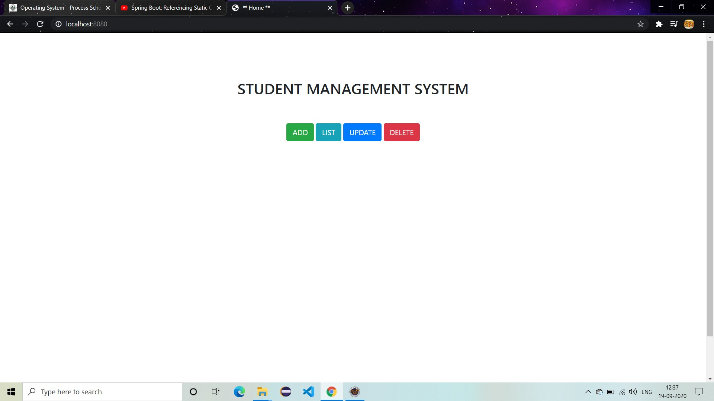
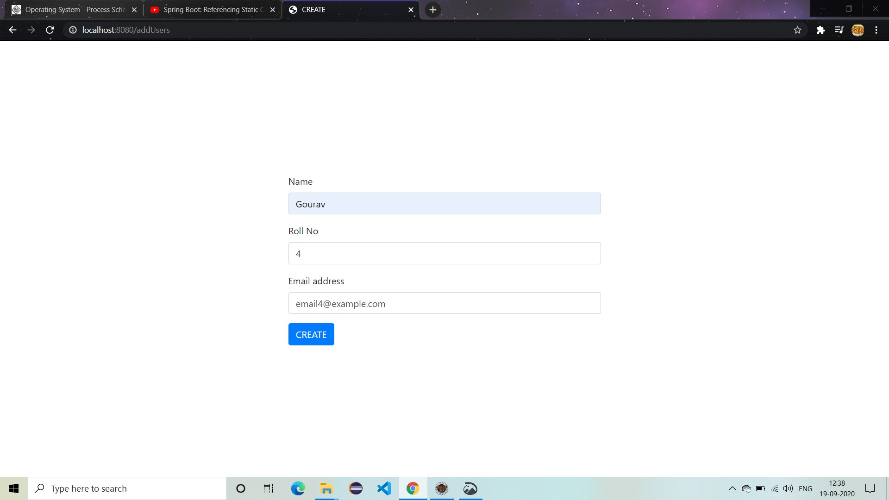
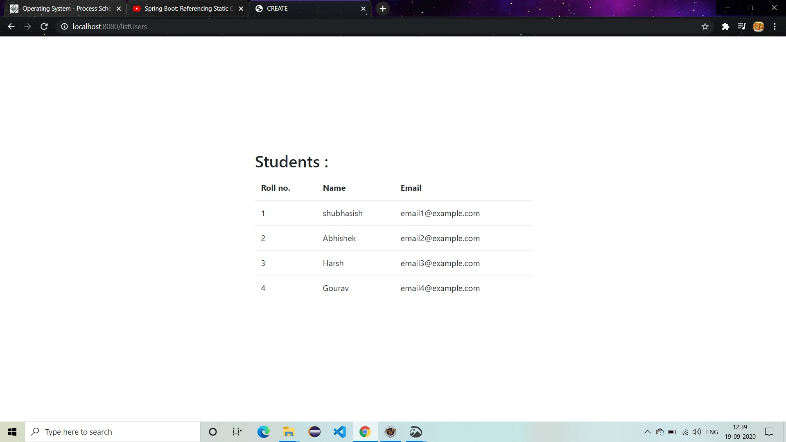
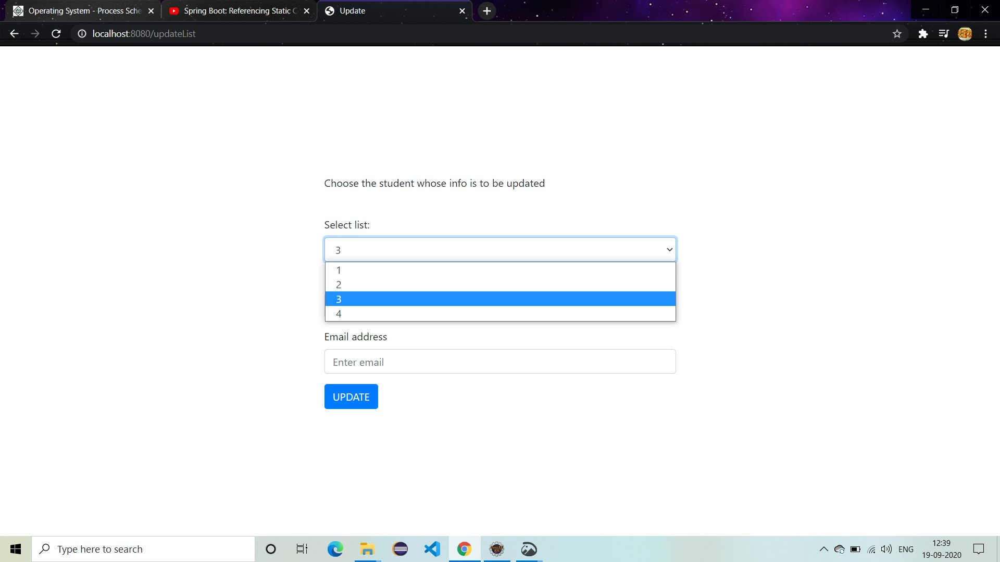
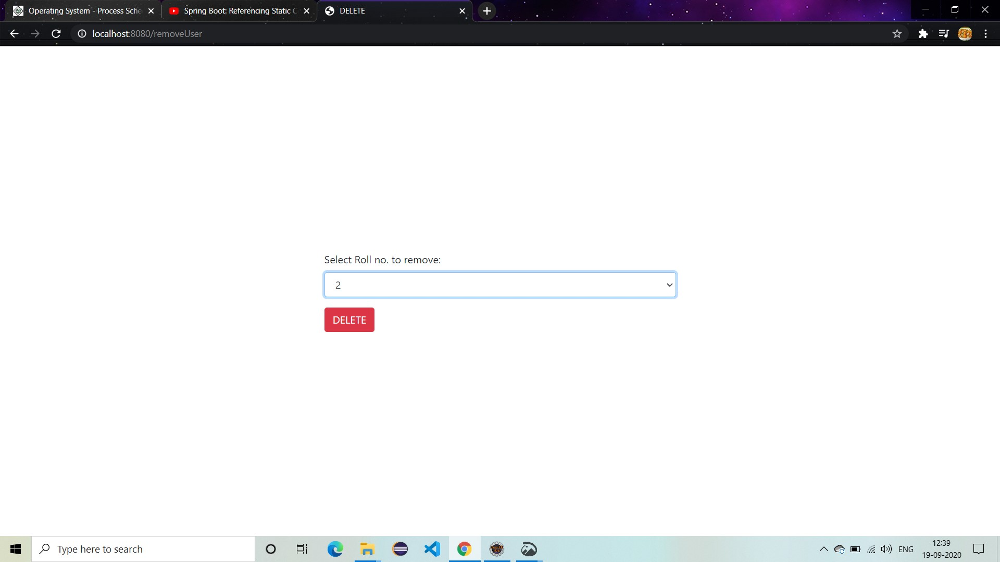

# Student Management System
**Built on Spring MVC framework, this project does 4 (C.R.U.D.) operation on MySql database present locally on the server.
It uses tomcat embeded server, JPA and Hibernate for SQL related operations, and Thymeleaf for managing views.**

# How to setup
1. Install and configure MySql on your machine and edit the application.properties in the resource folder accordingly before starting the spring boot app.
   (Create a user , grant all permission to a particular database to that user, use that database and create a table of 'User' inside it with rollno primary key, name and email)
2. Run the Demo2Application.java in the src/main/java/com/example/demo/controller as a Java Application, you can use Eclipse to do this.
3. Server will start on a port.(See the conole for the port no. most probably it will be 8080, or http://localhost:8080)

# Home

# Add

# List

# Update

# Delete

